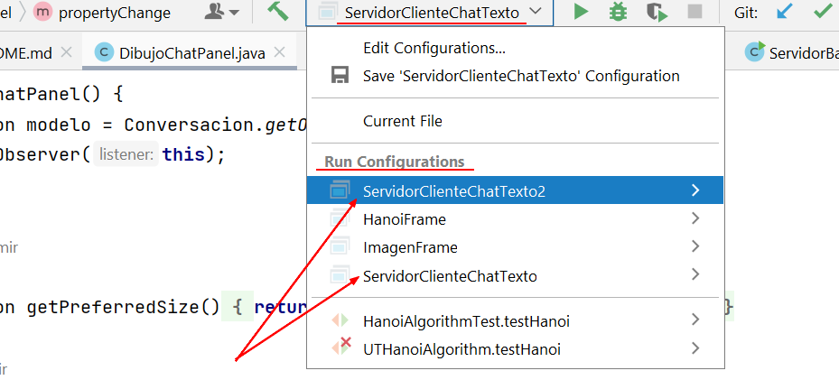
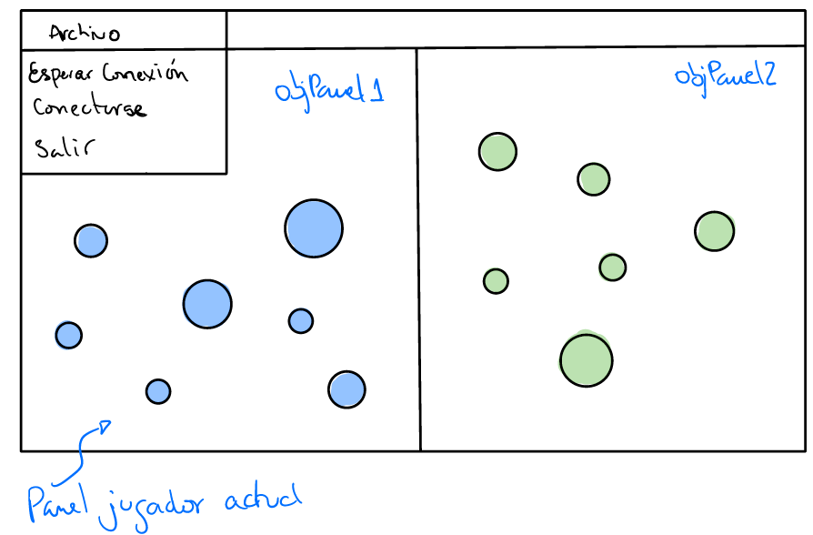

# Práctico 3 - Juego en línea

## Objetivo
Realizar un programa con interfaz gráfica que implemente
un juego en línea que funciona a la vez de servidor
y cliente.

## Características obligatorias

* El protocolo del juego debe ir documentado en alguna clase
* Logs de lo que pasa en el juego
* Observer para implementar los cambios en el juego
* Hilos para recibir los comandos del contrincante
* Implementar MouseListener para identificar qué comando enviar

## Descripción general

El juego consiste en un solo programa Java que muestra
una pantalla partida en 2 donde se puede ver a la izquierda
el campo del contrincante y a la derecha el campo propio.
Un poco a manera de batalla naval.

Una vez el juego comienza, el jugador que es más rápido
con el mouse para matar todas las piezas del jugador 
contrario, gana.

## Ejecutar dos veces el mismo archivo
Este programa requiere que se ejecute dos veces, una para
el servidor y otra para el cliente. Por lo tanto, se debe
ejecutar dos veces el mismo archivo.

Para poder ejecutar dos veces el mismo archivo se debe
crear dos configuraciones de ejecución en Idea. De esta
manera, elige una configuración y se ejecuta el programa
y abre una ventana. Luego, se elige la otra configuración y
se ejecuta nuevamente el mismo programa y abre otra ventana.

## Funcionalidades
A continuación las funcionalidades que debe 
tener el juego.

### Estructura del juego
El juego consiste en 7 piezas que se generan al azar
en el campo del jugador. Estas piezas pueden ser cuadrados
o círculos de diferente tamaño. Por lo tanto, cada
pieza tiene:
* Un tipo (cuadrado o círculo)
* Un tamaño
* Una posición en el campo
* Un estado (viva o muerta)

El juego muestra a cada jugador AMBOS campos, el propio
y el del contrincante. Cada jugador tiene un color diferente
para sus piezas.

El jugador puede matar las piezas del contrincante haciendo
clic sobre ellas. Si acierta, la pieza muere y se muestra
en el campo del contrincante como muerta. Esta información
es transmitida por el socket en línea al contrincante; el 
cual debe actualizar su campo.

### Pantalla de juego
Al iniciar el juego la pantalla muestra dos campos vacíos
con un menu. (En la figura se ve con las piezas)

### Funcionalidad Servidor - Esperar conexión
La opción de esperar conexión solamente avisa al jugador
que está esperando a que se conecte el otro jugador.
El puerto en el cual espere la conexión debe ser un
puerto por defecto a su elección (e.g. 8492).

### Funcionalidad Cliente - Conectar a servidor
La opción de conectar a servidor debe abrir un popup
para que el jugador ingrese la dirección IP del servidor.
Recuerde que el puerto ya viene por defecto.

### Desarrollo del juego
Cuando la conexión se establece, el juego comienza.
1. Cada jugador envía un mensaje con la configuración de su campo (7 piezas)
2. Cada jugador recibe el mensaje del otro jugador y actualiza la pantalla
3. El juego habilita el mouse listener en el panel de las piezas del contrincante
4. Cuando hace clic en el panel del contrincante, se envía un mensaje del disparo realizado
5. El otro jugador recibe el mensaje y marca la pieza como muerta si corresponde
6. Y envía la información del nuevo estado de la pieza.
7. Si la pieza marcada es la última, el juego termina y muestra un mensaje de ganador

### Protocolo del juego
Para este ejercicio tenga cuidado de definir previamente
cuál es el protocolo que gobierna el juego. Cuáles son
los comandos posibles y cuáles son los argumentos y los
tipos de argumentos en todo momento.

En la clase que programe el protocolo debe documentar el
mismo para que sea sencillo de entender al momento de la
revisión. 

Para ver un ejemplo de protocolo y una explicación básica
puede ver esta entrada de [blog](https://itsanitworld.blogspot.com/2023/05/protocolos-que-son.html).
